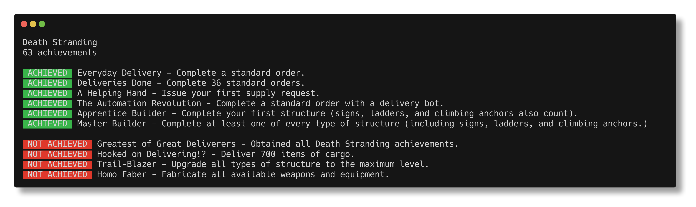

# steam-achievements

Command-line tool to see player achievements for a steam game. Uncovers hidden achievements from the game schema.

Usage:

```bash
node --loader ts-node/esm index.ts --steamid <STEAMID> --appid <APPID>
```



# Known Issues

Node, Typescript, and ts-node are having some trouble working with each other through the ESM transition. Your installed 
node and npm version, along with `package.json` and `tsconfig.json` may be finicky. See 
`https://gist.github.com/sindresorhus/a39789f98801d908bbc7ff3ecc99d99c` and 
`https://github.com/TypeStrong/ts-node/issues/1007` for more details.
